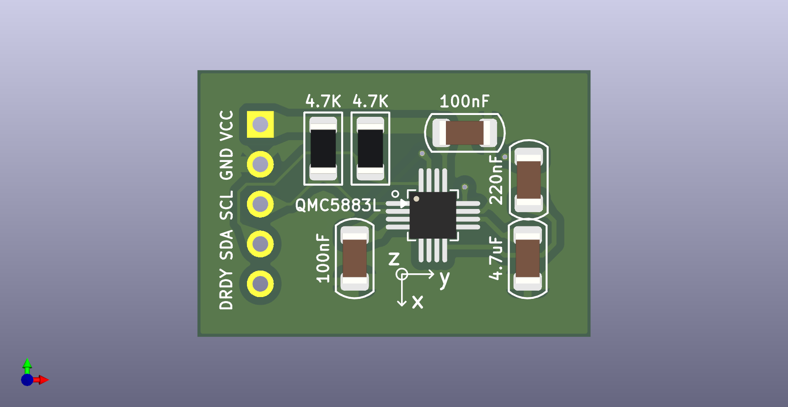

# QMC5883L  
  
    
    
  
封装 LGA16(3x3,p0.5) 可以焊接, 焊盘需要加长  
  
[datasheet](https://www.jlc-smt.com/lcsc/detail?componentCode=C976032)  
  
VDD 2.16V~3.6V  
VDDIO 1.65V~3.6V  
电流消耗 最大850uA  
16bit ADC  
the default  I2C address is 0D: 0001101    
DRDY : 数据准备好上拉,被读取下拉  
  
[模块参考](https://item.taobao.com/item.htm?abbucket=4&detail_redpacket_pop=true&id=670631408699&ltk2=1747749644070qp6qp09jpq23lzgjg8umnh&ns=1&priceTId=213e044f17477496188852615e1bc5&query=qmc5883l%E6%A8%A1%E5%9D%97&spm=a21n57.1.hoverItem.2&utparam=%7B%22aplus_abtest%22%3A%2288fea62abbedbf266e4b60de05d06fd2%22%7D&xxc=taobaoSearch)